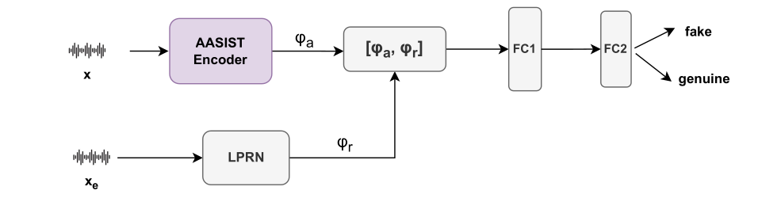
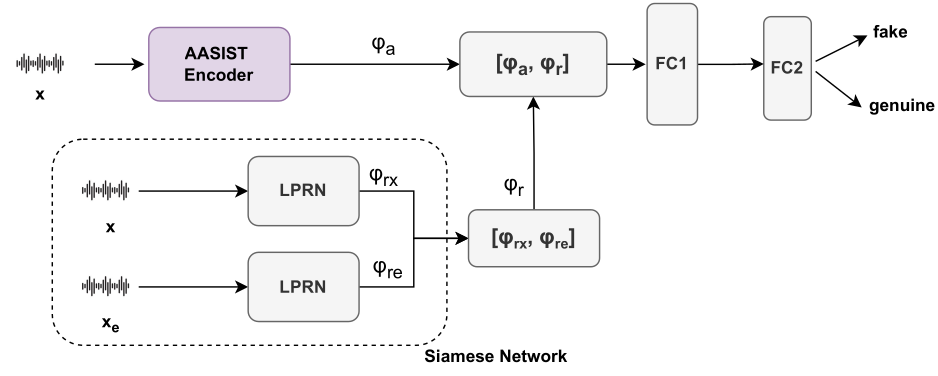

# Speaker Aware Deepfake Detectectors

The code in this repository is the official implementation of the paper "IS THAT ME? USING SPEAKER IDENTITY TO DETECT FAKE SPEECH". The link to the paper is available [here](https://faculty.iitmandi.ac.in/~padman/papers/shilpa_IsThatMe_MLSP2024.pdf).

This repository provides the two frameworks for detecting speech deepfakes using speaker information.

## Getting started
First, clone the repository locally

```bash
git clone https://github.com/shilpac131/SADD.git
cd SADD
```

The models are trained on the logical access (LA) train  partition of the ASVspoof 2019 dataset, which can can be downloaded from [here](https://datashare.is.ed.ac.uk/handle/10283/3336).

The models are tested on the LA partion of ASVspoof 2019 and 2021.

### Pre-requisites

**⚠️ Note:** The speaker information in this paper is captured using LP residuals.

To extract the LP residuals of the ASVspoof2019(LA) and ASVspoof2021(LA).

```bash
python LPC_residual --set_type eval --order 16
```
Make sure to give the correct path for the datasets in the code and the LP order used in paper is 16.

## Experiments

### I. Speaker-aware deepfake detector(SADD)

This network uses spekar information captured from the LP residual. To capture information from the LP residual, we utilize a multi-scale convolution-based architecture with varying kernel sizes, followed by a transformer encoder layer for capturing long range dependencies.


Run the following command to train the SADD network.
```bash
python main_SADD.py
```

### II. Siamese speaker-aware deepfake detector(sSADD)

The simple concatenation of speaker characteristics, though effective, fails to explicitly associate the common speaker information in the enrollment utterance and the input utterance. To mitigate this, we use a Siamese-based LPRN network with a pair of utterances from the same speaker, one of which is the enrollment utterance. The resulting network is termed as Siamese speaker-aware deepfake detector (sSADD)


Run the following command to train the SADD network.
```bash
python main_sSADD.py
```
